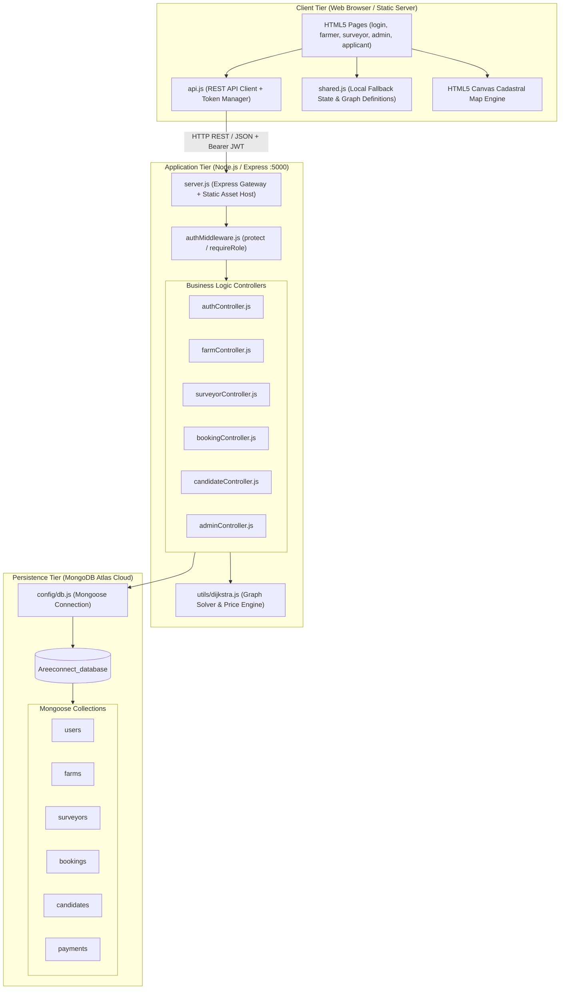
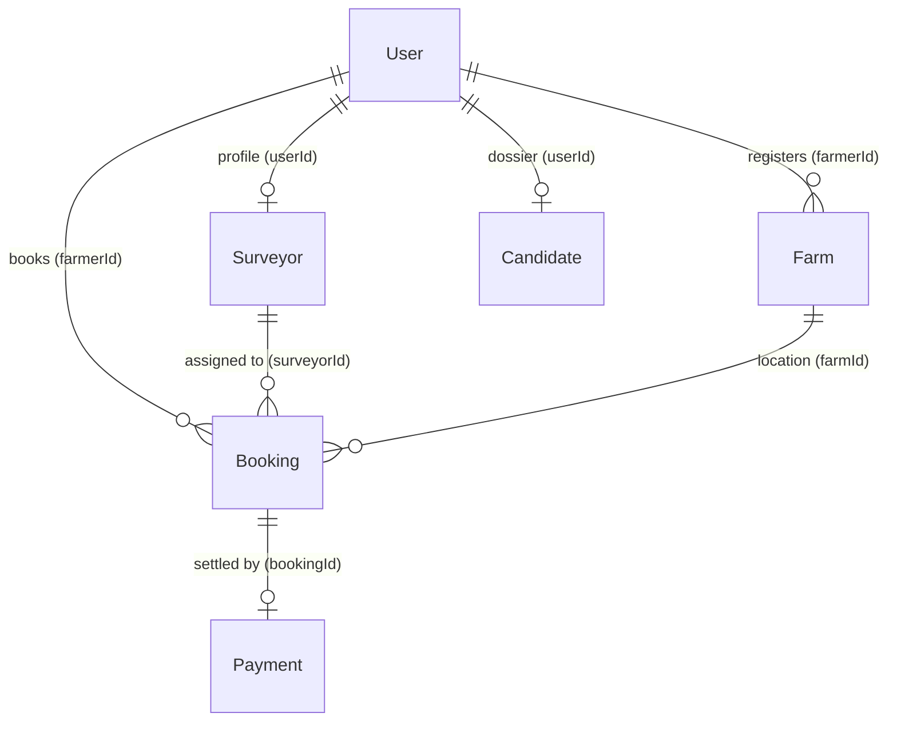
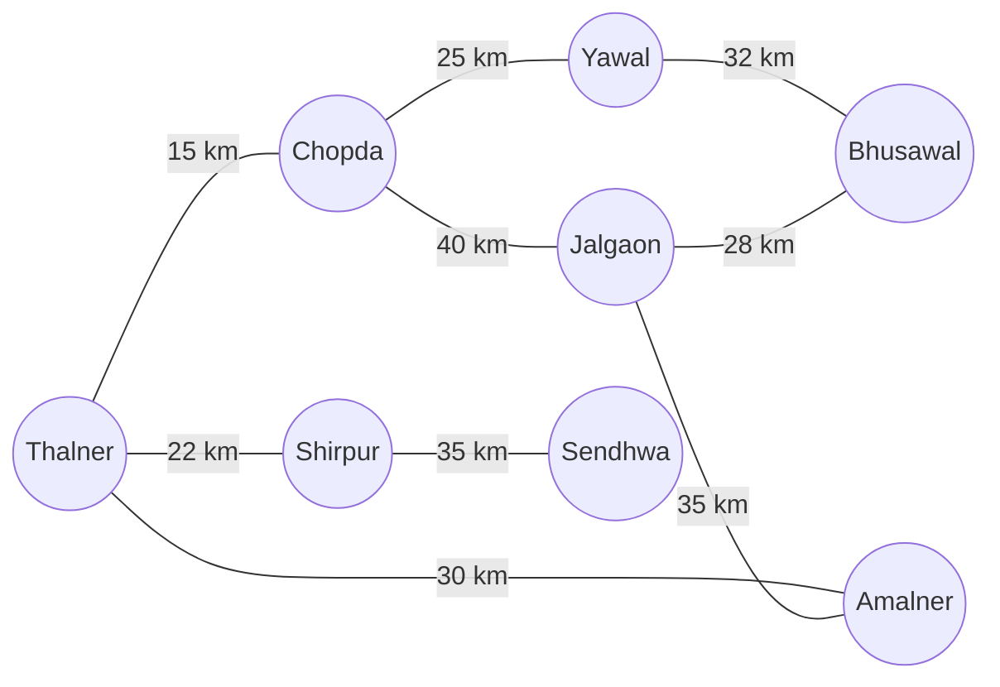
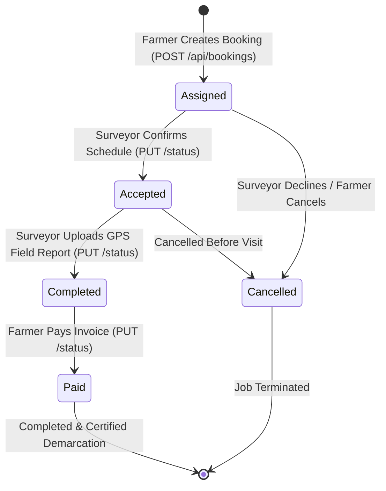

# System Design & Architecture Document (DESIGN.md)

## Project Name: **AgriConnect (कृषि-कनेक्ट)**
### Subtitle: *Digital Agricultural Land Survey & Surveyor Management Architecture*
**Document Version:** 3.0 (Production Node.js & MongoDB Atlas Edition)  
**Status:** Implemented, Audited & Verified  
**Author:** AgriConnect Systems Architecture & Engineering Team  

---

## 1. High-Level Architecture

AgriConnect operates on a modern **3-Tier Micro-Monolithic Architecture** with an intelligent **Hybrid Offline Resilient Fallback Engine**:
1. **Client View Layer**: Pure semantic HTML5, CSS3 Glassmorphism tokens (`shared_styles.css`), FontAwesome icons, Canvas API for cadastral map rendering, and ES6 JavaScript controllers.
2. **API & Business Logic Layer**: Node.js & Express.js REST API with modular routers, JWT/RBAC middleware, and in-memory graph theory routing engine (`dijkstra.js`).
3. **Persistence Layer**: Cloud MongoDB Atlas Cluster (`cluster0.0qqka4s.mongodb.net`, database: `Areeconnect_database`) with structured Mongoose schemas and strict relational validation.



---

## 2. Directory Structure & File Hierarchy

```text
agriconnect/
├── index.html                   # Landing page, animated KPI counters, helpline widget
├── login.html                   # Unified 3-tier resilient login (Farmer / Surveyor / Admin)
├── register.html                # Farmer account registration
├── farmer.html                  # Farmer dashboard: plot registry, Dijkstra proximity search, bookings
├── surveyor.html                # Surveyor dashboard: job dispatch, appointment scheduling, canvas map
├── apply.html                   # Surveyor candidate 8-phase application dossier
├── applicant.html               # Surveyor applicant portal: timeline, docs, offer letter
├── admin.html                   # Operations admin control: candidate verification, taluka caps, ledger
├── api.js                       # Reusable REST client with auth storage and timeout control
├── config.js                    # Environment constants and base API URL configuration
├── shared.js                    # Graph network, Dijkstra solver, and client-side database engine
├── shared_styles.css            # Emerald glassmorphism design tokens and CSS variables
├── PRD.md                       # Product Requirements Document
├── DESIGN.md                    # System Architecture & Technical Design Document
│
└── backend/                     # Node.js / Express Backend Subsystem
    ├── server.js                # Main Express gateway, middleware mounts, static host
    ├── .env                     # MongoDB URI, PORT=5000, JWT_SECRET
    ├── package.json             # Express, Mongoose, bcryptjs, jsonwebtoken, cors, dotenv
    ├── config/
    │   └── db.js                # Mongoose connection manager to MongoDB Atlas
    ├── middleware/
    │   └── authMiddleware.js    # JWT verification ('protect') & RBAC ('requireRole')
    ├── models/
    │   ├── User.js              # User schema (auth, bcrypt passwordHash, role, status)
    │   ├── Farm.js              # Farm plot schema (farmerId, acreage, surveyType, cost)
    │   ├── Surveyor.js          # Surveyor schema (userId, employeeId, baseStation, taluka)
    │   ├── Booking.js           # Booking schema (farmerId, surveyorId, area, cost, status)
    │   ├── Candidate.js         # Candidate dossier schema (userId, qualifications, scores)
    │   ├── Payment.js           # Payment transaction ledger
    │   └── SurveyReport.js      # Cadastral survey report document
    ├── controllers/
    │   ├── authController.js    # Register, login with employeeId support, getMe
    │   ├── farmController.js    # Create farm, get user farms, update, delete
    │   ├── surveyorController.js# Create surveyor, list with filters, update status
    │   ├── bookingController.js # Create booking, assign Dijkstra, update status machine
    │   ├── candidateController.js# Submit dossier, get profile, update milestones
    │   └── adminController.js   # Aggregate metrics, candidate approval, quota audits
    ├── routes/
    │   ├── authRoutes.js        # /api/auth
    │   ├── farmRoutes.js        # /api/farms
    │   ├── surveyorRoutes.js    # /api/surveyors
    │   ├── bookingRoutes.js     # /api/bookings
    │   ├── candidateRoutes.js   # /api/candidates
    │   └── adminRoutes.js       # /api/admin
    └── utils/
        └── dijkstra.js          # Graph road network, Dijkstra path solver, pricing formula
```

---

## 3. Database Schema Specifications (MongoDB Atlas `Areeconnect_database`)



### 3.1 User Schema (`users`)
```javascript
{
  _id: ObjectId,
  name: { type: String, required: true, trim: true },
  email: { type: String, required: true, unique: true, lowercase: true, trim: true },
  mobile: { type: String, required: true, unique: true, trim: true },
  passwordHash: { type: String, required: true }, // bcrypt salt rounds: 10
  role: { 
    type: String, 
    enum: ['farmer', 'surveyor', 'candidate', 'admin'], 
    default: 'farmer' 
  },
  status: { 
    type: String, 
    enum: ['active', 'inactive', 'suspended'], 
    default: 'active' 
  },
  createdAt: Date,
  updatedAt: Date
}
```

### 3.2 Surveyor Schema (`surveyors`)
```javascript
{
  _id: ObjectId,
  userId: { type: ObjectId, ref: 'User', required: true, unique: true, index: true },
  employeeId: { type: String, unique: true, sparse: true, trim: true }, // e.g. AGR-2026-004
  name: { type: String, required: true, trim: true },
  baseStation: { type: String, required: true, trim: true }, // Graph node (e.g. Shirpur)
  taluka: { type: String, required: true, lowercase: true, trim: true },
  status: { 
    type: String, 
    enum: ['available', 'assigned', 'busy', 'inactive'], 
    default: 'available',
    lowercase: true 
  },
  rating: { type: Number, default: 5.0, min: 0, max: 5 },
  jobsCompleted: { type: Number, default: 0, min: 0 },
  createdAt: Date,
  updatedAt: Date
}
```

### 3.3 Farm Schema (`farms`)
```javascript
{
  _id: ObjectId,
  farmerId: { type: ObjectId, ref: 'User', required: true, index: true },
  farmName: { type: String, required: true, trim: true },
  village: { type: String, required: true, trim: true },
  location: {
    address: String,
    latitude: { type: Number, min: -90, max: 90 },
    longitude: { type: Number, min: -180, max: 180 }
  },
  acreage: { type: Number, required: true, min: 0.01 },
  contactNumber: String,
  surveyType: {
    type: String,
    enum: [
      'Boundary Tally',
      'Boundary Tally & Verification',
      'Farm Subdivision',
      'Layout & Landmark',
      'Precise Layout & Landmark',
      'Land Survey',
      'Standard Survey',
      'Other'
    ],
    default: 'Boundary Tally'
  },
  estimatedCost: { type: Number, min: 0, default: 0 },
  createdAt: Date,
  updatedAt: Date
}
```

### 3.4 Booking Schema (`bookings`)
```javascript
{
  _id: ObjectId,
  farmerId: { type: ObjectId, ref: 'User', required: true, index: true },
  surveyorId: { type: ObjectId, ref: 'Surveyor', index: true },
  farmId: { type: ObjectId, ref: 'Farm', index: true },
  surveyType: { type: String, default: 'Boundary Tally' },
  area: { type: Number, required: true, min: 0.01 },
  cost: { type: Number, required: true, min: 0 },
  distance: { type: Number, default: 0, min: 0 },
  status: {
    type: String,
    enum: ['Assigned', 'Accepted', 'Completed', 'Paid', 'Cancelled'],
    default: 'Assigned'
  },
  appointmentDate: String,
  appointmentTime: String,
  preparationInstructions: String,
  report: {
    lat: String,
    lng: String,
    acreage: String,
    observations: String,
    mapImage: String, // Base64 data URL
    submittedAt: Date
  },
  createdAt: Date,
  updatedAt: Date
}
```

---

## 4. Algorithmic Specifications

### 4.1 Dijkstra Shortest-Path Road Network Solver

The regional inter-taluka road network is modeled as a weighted graph $G = (V, E, W)$:



```javascript
// utils/dijkstra.js
function solveDijkstra(startNode) {
  const distances = {};
  const prev = {};
  const allNodes = Object.keys(graph);

  for (const node of allNodes) {
    distances[node] = Infinity;
    prev[node] = null;
  }

  const matchedNode = allNodes.find(n => n.toLowerCase() === String(startNode || '').toLowerCase()) || 'Thalner';
  distances[matchedNode] = 0;

  const pq = new Set(allNodes);

  while (pq.size > 0) {
    const u = [...pq].reduce((a, b) => (distances[a] < distances[b] ? a : b));
    pq.delete(u);

    if (distances[u] === Infinity) break;

    for (const [v, weight] of Object.entries(graph[u] || {})) {
      const alt = distances[u] + weight;
      if (alt < distances[v]) {
        distances[v] = alt;
        prev[v] = u;
      }
    }
  }

  return { distances, prev };
}
```

### 4.2 Authoritative Tiered Pricing Logic
```javascript
function calculateBookingCost(acreage) {
  const a = Number(acreage);
  if (!a || a <= 0) return 0;
  if (a <= 3) return Math.ceil(a * 1000);
  if (a <= 8) return Math.ceil(a * 800);
  return Math.ceil(a * 600);
}
```

---

## 5. REST API Endpoint Specification

### Authentication Routes (`/api/auth`)
| Method | Endpoint | Auth | Description |
|---|---|---|---|
| `POST` | `/api/auth/register` | Public | Register new User (`farmer` or `candidate`) |
| `POST` | `/api/auth/login` | Public | Authenticate via email, mobile, or Employee ID & return JWT |
| `GET` | `/api/auth/me` | JWT | Get authenticated user profile |

### Farm Routes (`/api/farms`)
| Method | Endpoint | Auth | Description |
|---|---|---|---|
| `GET` | `/api/farms` | Farmer/Admin | Retrieve farm plots owned by caller |
| `POST` | `/api/farms` | Farmer | Register farm plot with server-side cost calculation |
| `GET` | `/api/farms/:id` | Farmer/Admin | Get specific farm (ownership enforced) |
| `PUT` | `/api/farms/:id` | Farmer | Update farm plot details |
| `DELETE` | `/api/farms/:id` | Farmer/Admin | Delete farm plot |

### Surveyor Routes (`/api/surveyors`)
| Method | Endpoint | Auth | Description |
|---|---|---|---|
| `GET` | `/api/surveyors` | Authenticated | List surveyors with query filters (`?taluka=...&status=...`) |
| `GET` | `/api/surveyors/:id` | Authenticated | Get surveyor details by ID or Employee ID |
| `POST` | `/api/surveyors` | Admin | Create surveyor profile with User linking & password hashing |
| `PUT` | `/api/surveyors/:id/status` | Surveyor/Admin | Update surveyor availability (owner check enforced) |

### Booking Routes (`/api/bookings`)
| Method | Endpoint | Auth | Description |
|---|---|---|---|
| `GET` | `/api/bookings` | Authenticated | List bookings (role-filtered for Farmer, Surveyor, or Admin) |
| `POST` | `/api/bookings` | Farmer | Create booking, assign Dijkstra surveyor, enforce pricing |
| `GET` | `/api/bookings/:id` | Authenticated | Get booking details (tenant isolation enforced) |
| `PUT` | `/api/bookings/:id/status` | Authenticated | Execute state transition (`Assigned` $\rightarrow$ `Accepted` $\rightarrow$ `Completed` $\rightarrow$ `Paid`) |

### Candidate & Recruitment Routes (`/api/candidates`)
| Method | Endpoint | Auth | Description |
|---|---|---|---|
| `POST` | `/api/candidates` | Candidate | Submit application dossier |
| `GET` | `/api/candidates/me` | Candidate | Get applicant status and milestones |
| `PUT` | `/api/candidates/me` | Candidate | Update applicant profile |
| `GET` | `/api/candidates/:id` | Admin | Get candidate evaluation details |

### Admin Governance Routes (`/api/admin`)
| Method | Endpoint | Auth | Description |
|---|---|---|---|
| `GET` | `/api/admin/dashboard` | Admin | District analytics metrics |
| `GET` | `/api/admin/candidates` | Admin | Query candidate applications with status filters |
| `PUT` | `/api/admin/candidates/:id` | Admin | Score interview, background check & auto-activate Surveyor |
| `GET` | `/api/admin/surveyors` | Admin | All surveyors audit |
| `GET` | `/api/admin/bookings` | Admin | District-wide booking ledger |

---

## 6. State Machine Specifications

### 6.1 Booking Lifecycle State Machine


**State Transition Matrix**:
* `Assigned` $\rightarrow$ `['Accepted', 'Cancelled']`
* `Accepted` $\rightarrow$ `['Completed', 'Cancelled']`
* `Completed` $\rightarrow$ `['Paid']`
* `Paid` $\rightarrow$ `[]`
* `Cancelled` $\rightarrow$ `[]`

---

## 7. Security Architecture & Access Control

1. **Authentication Token Lifecycle**:
   * Token Type: Bearer JWT (`HMAC-SHA256`).
   * Expiration: 7 days (`JWT_EXPIRES_IN=7d`).
   * Payload: `{ userId: ObjectId, role: 'farmer'|'surveyor'|'candidate'|'admin' }`.
2. **Middleware Pipeline**:
   * `protect`: Verifies Bearer token, decodes payload, loads `req.user` from database.
   * `requireRole(...roles)`: Verifies `req.user.role` matches allowed roles.
3. **Tenant & Plot Isolation**:
   * Farmers can only query or book their own farm plots (`farm.farmerId == req.user._id`).
   * Farmers cannot view or pay for other farmers' bookings.
   * Surveyors can only view and submit field reports for jobs assigned to their profile.
4. **Credential Hashing**:
   * All passwords hashed with `bcryptjs` (salt rounds: 10). Passwords and password hashes are never exposed via REST API responses.
