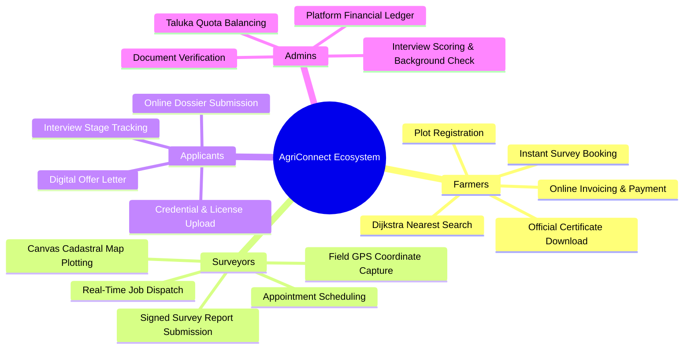
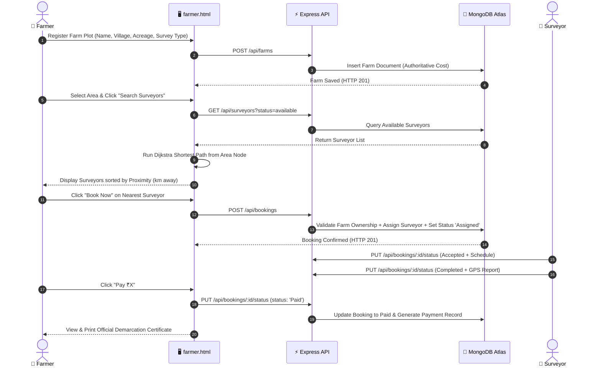
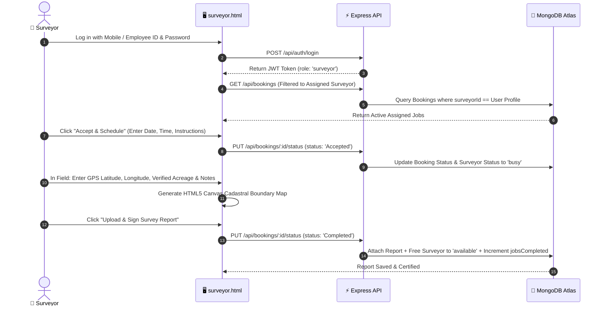
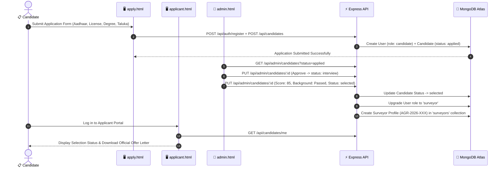

# Product Requirements Document (PRD)

## Project Name: **AgriConnect (कृषि-कनेक्ट)**
### Subtitle: *Digital Agricultural Land Survey & Surveyor Management Platform*
**Document Version:** 3.0 (Production Architecture Edition)  
**Status:** Approved & Verified  
**Target Release:** 2026  
**Stack:** HTML5/CSS3/ES6 Vanilla JS + Node.js/Express REST API + MongoDB Atlas (`Areeconnect_database`)  
**Author:** AgriConnect Core Engineering & Systems Architecture Team  

---

## 1. Executive Summary & Vision

### 1.1 Executive Summary
**AgriConnect** is an integrated full-stack digital platform connecting agricultural landowners (farmers), certified land surveyors, job applicants, and district operations administrators. The platform digitizes the entire land measurement lifecycle:
1. **Farmer Plot Registration**: Seamless capture of land plot records, acreage, location, and survey specifications.
2. **Dijkstra-Powered Proximity Discovery**: Real-time road network routing to match farmers with the nearest available certified surveyors.
3. **Authoritative Tiered Pricing Engine**: Transparent, non-tamperable survey cost calculation.
4. **Surveyor Field Operations**: Digital job dispatch, appointment scheduling, field GPS coordinate capture, and HTML5 canvas cadastral map generation.
5. **Legally Verifiable Survey Certificates**: Instant generation of official demarcation certificates with digital signatures.
6. **Recruitment & Taluka Capacity Allocation**: An 8-phase pipeline for onboarding, vetting, testing, and quota-balancing certified civil surveyors.
7. **Operational Governance**: Real-time district monitoring, financial tracking, and role-based administrative control.

### 1.2 Vision Statement
*"To eliminate land boundary disputes, reduce surveyor turnaround times from weeks to hours, and empower rural farming communities through accessible, transparent, and mathematically optimized digital land surveying."*

---

## 2. Problem Statement & Market Opportunity

### 2.1 The Problem
1. **Lengthy Surveyor Discovery**: Farmers in rural talukas wait 15–45 days to find certified land surveyors, relying on manual word-of-mouth.
2. **Opaque & Unregulated Pricing**: Unregulated land measurement costs vary unpredictably, causing financial vulnerability for smallholders.
3. **Suboptimal Routing & Transit Overhead**: Surveyors travel haphazardly across talukas without proximity-based scheduling, leading to high fuel expenses and limited daily throughput.
4. **Disorganized Recruitment & Quota Imbalances**: Hiring civil surveyors across talukas lacks standardized credential validation, testing, and capacity balancing.
5. **Delayed Demarcation Records**: Hand-drawn paper sketches cause legal ambiguity, and official demarcation notices take weeks to be issued.

### 2.2 The Solution
AgriConnect provides a unified, zero-friction web application backed by a scalable Node.js/Express REST API and MongoDB Atlas cloud database featuring:
* **Authoritative Tiered Pricing Engine** (1–3 acres: ₹1000/acre, 4–8 acres: ₹800/acre, >8 acres: ₹600/acre).
* **Dijkstra Shortest-Path Graph Engine** calculating exact driving distances between 8 regional district nodes.
* **State-Machine Controlled Booking Lifecycle** (`Assigned` $\rightarrow$ `Accepted` $\rightarrow$ `Completed` $\rightarrow$ `Paid`).
* **HTML5 Canvas Cadastral Plotter** generating visual parcel maps (Boundary Tally and Farm Subdivision).
* **Role-Based Access Control (RBAC)** ensuring tenant isolation across Farmers, Surveyors, Candidates, and Admins.
* **3-Tier Resilient Fallback Pattern** guaranteeing high availability in low-connectivity rural environments.

---

## 3. User Personas & Target Audiences

### 3.1 Persona 1: The Landowner Farmer (e.g. Rohit Bhamare)
* **Profile**: 42 years old, farmer in Thalner village, owns 5.5 acres of cotton and banana plantation.
* **Goals**: Subdivide land among family members, verify boundary markers against canal expansion, get instant transparent pricing.
* **Pain Points**: Does not know who the nearest available surveyor is; worried about inflated fees and long delays.

### 3.2 Persona 2: The Certified Field Surveyor (e.g. Dhiraj Jadhav / Gaurav Khadse)
* **Profile**: 29 years old, Civil Engineering Diploma/Degree, base station at Shirpur / Chopda node.
* **Goals**: Receive localized booking requests within 15–30 km radius, schedule field visits, upload verified GPS survey notices.
* **Pain Points**: Spends hours driving back and forth; lacks a standardized digital tool to submit visual boundary maps.

### 3.3 Persona 3: The Surveyor Candidate / Applicant (e.g. Amit Deshmukh)
* **Profile**: 24 years old, B.Tech Civil Engineering graduate, applying for taluka surveyor allocation.
* **Goals**: Apply online, upload Aadhaar and Surveyor License, monitor recruitment milestones, access offer letter.
* **Pain Points**: Lack of feedback on job application status, interview schedules, and quota availability.

### 3.4 Persona 4: The Operations & HR Admin
* **Profile**: AgriConnect Regional Coordinator managing North Maharashtra talukas (Chopda, Thalner, Shirpur, Jalgaon).
* **Goals**: Review candidate credentials, score technical interviews, balance taluka quota capacities, audit platform bookings and revenue.

---

## 4. Detailed User Workflows & Journey Maps

### 4.1 Farmer Journey: Registration to Demarcation Certificate

---

### 4.2 Surveyor Journey: Job Dispatch to Field Report

---

### 4.3 Candidate Journey: Application to Taluka Surveyor Activation

---

## 5. Functional Requirements by Module

### FR-1: Unified Authentication & Access Control
* **FR-1.1**: Support multi-role login (*Farmer*, *Surveyor*, *Applicant*, *Admin*) via `/api/auth/login`.
* **FR-1.2**: Identifier support: Login accepts **Mobile Number**, **Email Address**, or **Surveyor Employee ID** (`AGR-2026-XXX`).
* **FR-1.3**: Cryptographic Password Security: All passwords hashed with `bcryptjs` (salt rounds: 10). Passwords are never returned in responses.
* **FR-1.4**: JWT Token Issuance: Generates signed HMAC-SHA256 JWT tokens containing `userId` and authoritative database `role`.
* **FR-1.5**: 3-Tier Resilient Fallback: Frontend utilizes a 3-tier fallback architecture:
  * *Tier 1*: `AgriConnectAuth.login()`
  * *Tier 2*: `AgriConnectAPI.apiPost()`
  * *Tier 3*: Standalone native browser `fetch()`

### FR-2: Public Discovery & Information Hub (`index.html`)
* **FR-2.1**: Animated KPI counters for live active farmers, certified surveyors, and covered talukas.
* **FR-2.2**: Visual 8-phase interactive recruitment roadmap.
* **FR-2.3**: Interactive AI Helpline Assistant widget with automated responses for booking, pricing, and portals.

### FR-3: Farmer Portal & Plot Management (`farmer.html`)
* **FR-3.1**: Farmer profile display with name, contact, village, taluka, and active status.
* **FR-3.2**: Farm Plot Registration (`POST /api/farms`):
  * Inputs: Farm Name/Ref, Village/Location, Acreage (numeric step 0.01), Contact Number, Survey Type.
  * Backend Validation: Non-negative acreage, valid village, standardized survey type enum.
* **FR-3.3**: Live Plot Repository (`GET /api/farms`): Displays all registered plots belonging to the authenticated farmer.

### FR-4: Proximity Routing & Dijkstra Matching Engine
* **FR-4.1**: Regional Graph Representation: 8 regional nodes (*Thalner, Chopda, Shirpur, Yawal, Jalgaon, Sendhwa, Amalner, Bhusawal*) connected with bidirectional road distances.
* **FR-4.2**: Shortest-Path Calculation: Computes driving distances from selected farmer area node to all available surveyors.
* **FR-4.3**: Result Sorting: Ranks available surveyors in ascending distance order, showing distance in km, rating stars, and jobs completed.
* **FR-4.4**: Instant Booking Dispatch: "Book Now" assigns the nearest surveyor, updates surveyor status to `busy`, and persists the booking document to MongoDB Atlas.

### FR-5: Authoritative Pricing Engine
* **FR-5.1**: Server-Enforced Tiered Pricing:
  $$\text{Cost} = \begin{cases} \lceil \text{Area} \times 1000 \rceil & \text{if Area} \le 3 \text{ acres} \\ \lceil \text{Area} \times 800 \rceil & \text{if } 3 < \text{Area} \le 8 \text{ acres} \\ \lceil \text{Area} \times 600 \rceil & \text{if Area} > 8 \text{ acres} \end{cases}$$
* **FR-5.2**: Tamper-Proofing: `req.body.cost` is ignored; the backend recalculates and enforces the authoritative cost.

### FR-6: Booking Lifecycle & State Machine
* **FR-6.1**: Strict Lifecycle Progression:
  $$\text{Assigned} \xrightarrow{\text{Surveyor Accepts}} \text{Accepted} \xrightarrow{\text{Field Report}} \text{Completed} \xrightarrow{\text{Farmer Pays}} \text{Paid}$$
  $$\text{Assigned / Accepted} \xrightarrow{\text{Decline / Cancel}} \text{Cancelled}$$
* **FR-6.2**: Rejection of Invalid Transitions: Jumping directly from `Assigned` to `Paid` returns `HTTP 400 Bad Request`.
* **FR-6.3**: Tenant Isolation: Farmer A cannot view or pay Farmer B's bookings (`HTTP 403 Forbidden`).

### FR-7: Surveyor Field Operations & HTML5 Canvas Cadastral Maps
* **FR-7.1**: Real-time job inbox filtering bookings assigned specifically to the logged-in surveyor.
* **FR-7.2**: Appointment scheduling form (Date, Time, Farmer preparation instructions).
* **FR-7.3**: Field report capture (GPS Latitude, GPS Longitude, Verified Acreage, Boundary observations).
* **FR-7.4**: HTML5 Canvas Cadastral Plotter:
  * *Boundary Tally*: Draws polygon with red GPS corner vertices and boundary labels.
  * *Farm Subdivision*: Draws split multi-lot parcels (Part A, Part B, Part C) with cadastral gridlines.
* **FR-7.5**: Official Demarcation Certificate: Digitally signed, printable official survey notice with embedded map and GPS coordinates.

### FR-8: Surveyor Candidate Recruitment & Applicant Portal
* **FR-8.1**: Candidate application dossier submission (`POST /api/candidates`).
* **FR-8.2**: Document upload placeholders (Aadhaar, ITI/Civil Degree, Surveyor License, Photo).
* **FR-8.3**: 6-stage applicant progress tracker (*Applied $\rightarrow$ Shortlisted $\rightarrow$ Interview $\rightarrow$ Selected $\rightarrow$ Hired*).
* **FR-8.4**: Official downloadable selection offer letter.

### FR-9: Admin Operations Dashboard (`admin.html`)
* **FR-9.1**: District-wide aggregate KPI cards (Total Users, Applied Candidates, Interview Pending, Active Surveyors).
* **FR-9.2**: Phase 2 Document Verification (Approve to Interview or Reject).
* **FR-9.3**: Phase 3 & 4 Interview & Background Check evaluation.
* **FR-9.4**: Phase 5 Taluka Quota Balancing: Live monitoring against taluka caps (*Chopda: 7, Thalner: 5, Shirpur: 5, Jalgaon: 7*).
* **FR-9.5**: Direct Surveyor Creation modal persisting directly to MongoDB Atlas.
* **FR-9.6**: All Bookings log and Finance/Revenue ledger.

---

## 6. Non-Functional Requirements (NFRs)

| Category | Requirement | Target Metric | Implementation Realization |
|---|---|---|---|
| **Performance** | API Response Time | $< 200\text{ms}$ | Mongoose indexing on `userId`, `farmerId`, `surveyorId`, `status`. |
| **Algorithmic Latency** | Dijkstra Shortest Path | $< 10\text{ms}$ | In-memory priority queue graph solver with $O((V+E)\log V)$ complexity. |
| **Availability** | System Uptime & Offline Resilience | 99.9% | 3-tier fallback architecture with seamless local storage sync. |
| **Security** | Authentication & RBAC | Zero Unauthorized Access | Signed JWT (HMAC-SHA256), bcrypt password hashing, `requireRole` middleware. |
| **Data Isolation** | Multi-Tenant Data Barrier | 100% Isolation | Strict ownership checks on every read/write operation. |
| **Responsiveness** | Cross-Device Layout | Mobile to Desktop | Mobile-first CSS Grid and Flexbox layouts. |

---

## 7. Key Performance Indicators (KPIs)

1. **Surveyor Allocation Latency**: Reduced from 14–45 days to $< 3$ minutes.
2. **Travel Distance Reduction**: $\sim 35\%$ average reduction in surveyor transit distance via Dijkstra nearest-node routing.
3. **Pricing Transparency**: 100% dispute-free pricing with server-enforced tiered rates.
4. **Recruitment Turnaround**: Candidate application to taluka deployment reduced from weeks to $< 48$ hours.
5. **Zero Data Loss**: Double-buffered state persistence across MongoDB Atlas and client storage.
